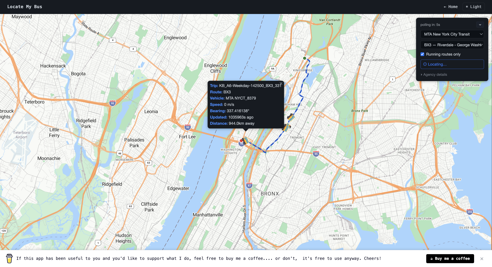

# Locate My Bus

**Live demo: [bus.ranjitpandey.dev](https://bus.ranjitpandey.dev)**

Real-time bus tracking for any GTFS-RT compatible transit agency. A C++ daemon fetches live vehicle position data every 15 seconds, stores it in PostgreSQL, and a Node.js/Express server exposes it to an Azure Maps browser client.



---

## Architecture

```
GTFS Static Feed (zip)          GTFS-RT Feed (protobuf)
        │                                │
        ▼                                ▼
  Agency Onboarding (Node.js)    C++ Daemon (every 15s)
  - Parses agency.txt            - Fetches unique feeds in parallel
  - Parses routes.txt            - Parses protobuf feeds async
  - Inserts into PostgreSQL      - Replaces live_vehicle_position
        │                                │
        └──────────────┬─────────────────┘
                       ▼
                  PostgreSQL DB
                  ├── public.agency
                  ├── public.route
                  ├── public.live_vehicle_position
                  ├── public.shape / shape_point
                  ├── public.trip
                  ├── public.poll_iteration
                  └── public.feed_execution
                       │
                       ▼
           Node.js / Express server
           - GET /live/:agency_id/:route_id → JSON
           - GET /routes/:agency_id         → JSON
           - GET /api/agencies              → JSON
           - POST /api/agencies/add         → onboard agency
           - DELETE /api/agencies/delete/:id
           - GET /api/dashboard/*           → monitoring stats
           - Serves static frontend
                       │
                       ▼
           Browser (Azure Maps SDK v3)
           - Dynamic agency + route selector
           - Polls /live every 15 seconds
           - Shows user location; auto-pins nearest bus
           - Distance to each bus in popup
           - Pinnable markers, light/dark theme
           - Pinned bus animates along route shape
```

---

## Getting Started

This project uses Dev Containers so your local environment stays clean. If you use Dev Containers you can skip the Prerequisites section.

### Prerequisites

`protoc` is required to generate the protobuf headers the daemon depends on.

- **macOS**
  ```sh
  brew install protobuf
  ```
- **Linux**
  ```sh
  sudo apt update && sudo apt install -y protobuf-compiler
  ```
- **Windows**
  Download the latest `protoc-*-win64.zip` from [github.com/protocolbuffers/protobuf/releases](https://github.com/protocolbuffers/protobuf/releases), extract it, and add the `bin` folder to your `PATH`.

You also need a running PostgreSQL instance. The schema is in `db/schema/init.sql`. Connection details are configured via environment variables:

```
POSTGRES_HOST=localhost
POSTGRES_USER=postgres
POSTGRES_PASSWORD=postgres
POSTGRES_DB=locate_my_bus
DELETE_ACCESS_KEY=<secret>    # required to add/delete agencies
AZURE_MAPS_KEY=<key>          # Azure Maps subscription key (proxied server-side)
```

### Installation

1. Clone the repo
   ```sh
   git clone git@github.com:ranjitp16/locate-my-bus.git && cd locate-my-bus
   ```

2. Open the Dev Container **or** build manually:
   ```sh
   make get-protobuf-headers && make build
   ```

3. Apply the database schema:
   ```sh
   psql -U postgres -d locate_my_bus -f db/schema/init.sql
   ```

4. Start the web server:
   ```sh
   npm run dev
   ```

5. Open `http://localhost:3000` and go to **Manage Agencies** to onboard a transit agency by providing its GTFS static and RT feed URLs.

6. Start the daemon (it will poll all agencies stored in the DB every 15 s):
   ```sh
   make run
   ```

7. Go to **View Map**, select an agency and route — live positions appear within 15 seconds.

### Docker

Both the daemon and web server have Dockerfiles.

```sh
# Build images
make docker        # daemon  → ranjitnovascotia/locate-my-bus:latest
make docker-web    # web     → ranjitnovascotia/locate-my-bus:web

# Run
make run-docker
make run-docker-web
```

---

## API

| Method   | Path                              | Auth | Description                              |
|----------|-----------------------------------|------|------------------------------------------|
| `GET`    | `/live/:agency_id/:route_id`      | —    | Live vehicle positions for a route       |
| `GET`    | `/routes/:agency_id`              | —    | All routes for an agency                 |
| `GET`    | `/api/agencies`                   | —    | List all onboarded agencies              |
| `POST`   | `/api/agencies/add`               | ✓    | Onboard a new agency                     |
| `DELETE` | `/api/agencies/delete/:id`        | ✓    | Remove an agency and its data            |
| `GET`    | `/api/dashboard/stats`            | ✓    | Aggregate poll stats                     |
| `GET`    | `/api/dashboard/iterations`       | ✓    | Last 50 poll iterations                  |
| `GET`    | `/api/dashboard/executions/:id`   | ✓    | Per-agency breakdown for an iteration    |
| `GET`    | `/api/dashboard/analytics`        | ✓    | Feed analytics and slow-feed detection   |
| `GET`    | `/api/dashboard/latency`          | ✓    | Download latency history per agency      |

Auth-protected routes require the `x-access-key` header to match `DELETE_ACCESS_KEY`.

**POST `/api/agencies/add` body:**
```json
{
  "static_feed_url": "https://example.com/gtfs.zip",
  "rt_feed_url":     "https://example.com/VehiclePositions.pb"
}
```

---

## How It Works

- **Agency onboarding** downloads the GTFS static zip, parses `agency.txt` and `routes.txt`, and inserts them into PostgreSQL in a single transaction.
- **The daemon** reads all agencies from the DB every 15 seconds, groups them by unique `rt_feed_url`, downloads each distinct feed in parallel (bounded by CPU core count), and replaces positions in `live_vehicle_position` with a DELETE + bulk INSERT per agency. Per-poll metrics are written to `poll_iteration` and `feed_execution` for monitoring.
- **The frontend** dynamically loads agencies and their routes, polls `/live/:agency_id/:route_id` every 15 seconds, and re-renders markers. All map calls go through a thin adapter (`map-adapter-azure.js`) that wraps Azure Maps SDK v3, keeping `map.html` free of any SDK-specific code. The browser Geolocation API tracks the user's position (shown as a pulsing blue dot); the nearest bus is automatically pinned each poll. Click a marker to manually pin it (map follows that bus and draws its route shape as an animated SVG overlay); click the map background to return to auto-pin. The pinned bus animates smoothly along the route shape between polls. Every bus popup shows its distance from the user via the Haversine formula. Map zoom and position are persisted in `localStorage`.

---

## License

Distributed under the MIT License. See `LICENSE.txt` for more information.

## Contact

Ranjit Pandey — [@know_me](https://ranjitpandey.dev) — [contact@ranjitpandey.dev](mailto:contact@ranjitpandey.dev)

## Further Reading

- [GTFS Realtime Reference](https://gtfs.org/documentation/realtime/proto/)
- [GTFS Static Reference](https://gtfs.org/documentation/schedule/reference/)
